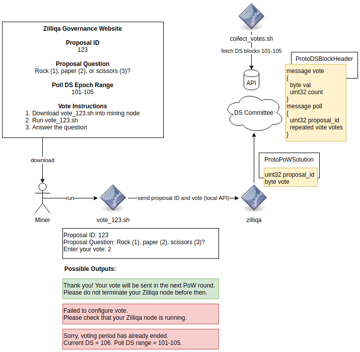

| ZIP | Title | Status| Type | Author | Created (yyyy-mm-dd) | Updated (yyyy-mm-dd)
|--|--|--|--| -- | -- | -- |
| 10  | Governance | Implemented | Standards Track  | Antonio Nunez <antonio@zilliqa.com>   Chetan Phirke <chetan@zilliqa.com> | 2020-07-24 | 2020-12-29

## Abstract

This ZIP introduces the support for governance by leveraging on miners' proof-of-work (PoW) submissions to cast votes on proposals.

## Motivation

The consensus protocol and immutable nature of blockchain provide useful tools for decision-making among multiple participants. In the context of the Zilliqa Mainnet, for instance, miners are those participants, and decision-making can include proposals put forward by Zilliqa Research or the Zilliqa community that require feedback (in the form of votes) from the mining community. Those votes can be tallied and made part of the blocks generated by the Mainnet, providing a permanent record that can be easily referenced by any party.

## Specification

This ZIP proposes a hybrid governance model that requires both off- and on-chain changes.

### Voting Frequency

Before going into the specifics, it should be emphasized that this model allows for multiple votes for a proposal. The guiding philosophy is that a miner's vote should continue to be counted for as long as its node has been in the network, since we can say that this miner has a larger stake in the network's operation.

### Off-chain Components

The initial setup is first done off-chain, i.e., outside of the protocol. This includes:

1. Publishing proposals on some widely-accessed portal.
   - This must be done well in advance of the voting period.
   - Proposals should detail the treatment of the voting results (e.g., target quorum, veto conditions, etc.).
1. Providing voting instructions to miners.
   - The proposals should be answerable in definite terms (for e.g., Yes or No, Rock Paper Scissors, etc.).
   - Voting instructions should also include the specific time range (e.g., DS epochs) when the voting will take place.
1. Coordinated casting of votes.
   - Miners should be supplied with an automated means of executing their votes (e.g., a simple script to configure their mining node).
1. Extracting results from the chain.

### On-chain Changes

Governance can be supported with potentially minimal changes to the core protocol.

1. At the start of the DS epoch, mining nodes attach an optional vote to their PoW submission messages. This vote consists of the proposal ID and the miner's vote value, which is specified by the different options listed in the published proposal (e.g., 1=Yes, 2=No).
1. The DS block header format is modified to include the counts for each vote value received by the DS committee. Since the counts are part of the header, they are naturally included in the DS block consensus performed by the committee.
1. To further the last point, only those PoW submissions belonging to the successfully sharded miners are considered.

### Sample Setup

### Implementation Considerations

#### Vote Configuration

This governance model should be implemented in such a way that makes it significantly easy for miners to cast their vote, with as little manual intervention as necessary.

To that end, the mining node's local API server (which listens at `STATUS_RPC_PORT`) needs to support a new API request message to set the proposal ID and vote value for the next pre-set number of DS epochs. A voting script (as shown in the illustration above) can be downloaded by the miner into the Zilliqa node's machine, and executed with as little inputs or steps as necessary.

In keeping with the guiding philosophy of allowing multiple votes per miner, the on-chain changes to the core protocol should enable a node to perform this multiple voting by default. This actually becomes a viable alternative to keeping track of voter identities if we want a tenure-based voting approach.

Finally, the implementation should be such that a node that fails to get sharded should be able to re-attempt casting its vote in the next DS epoch, without having to configure the node once again.

#### DS Nodes

Pre-existing DS nodes can potentially stay within the network for a long period of time. In the current Mainnet, `NUM_DS_ELECTION=10` with ~17 DS epochs daily means a well-performing node can expect to stay within the 600-note committee for over 3 days. This means that:

1. Voting campaigns should be made significantly longer than this time period, in order for these nodes to have enough time to be removed from the committee and perform another PoW submission.
1. Votes from nodes that get sharded into the DS committee should be given a different, larger weight. For consistency, we can leave the treatment for these votes to the off-chain part, so long as the votes within the DS block can be easily distinguished as belonging to shard or DS nodes.

## Rationale

Although this proposal introduces many moving parts, the relatively small changes to the core protocol required for governance provide a new avenue of utility for the Zilliqa blockchain.

## Implementation

This ZIP is implemented in Zilliqa version [7.0.0](https://github.com/Zilliqa/Zilliqa/releases/tag/v7.0.0).

## Backward Compatibility

This ZIP introduces changes to the blockchain data that break compatibility with older versions.

## Copyright Waiver 

Copyright and related rights waived via [CC0](https://creativecommons.org/publicdomain/zero/1.0/).
