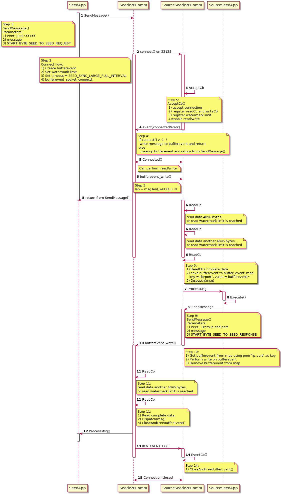
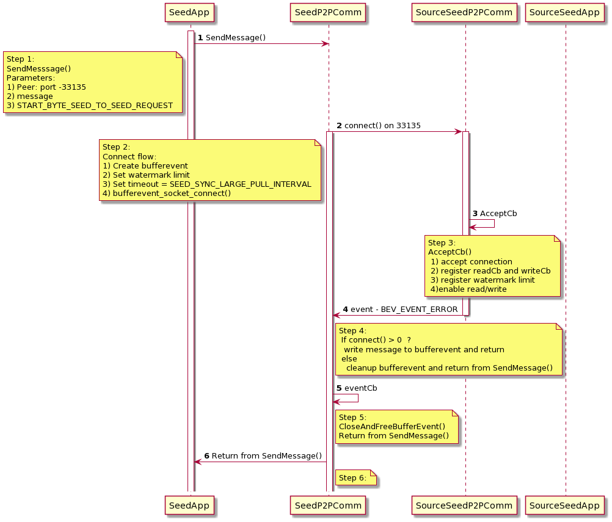
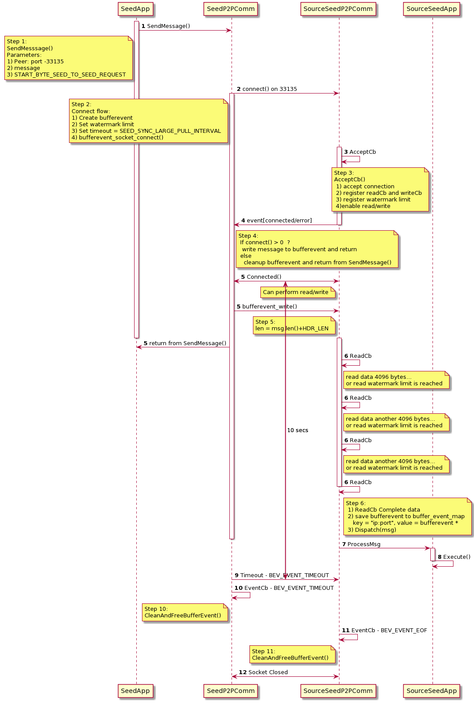

| ZIP | Title | Status| Type | Author | Created (yyyy-mm-dd) | Updated (yyyy-mm-dd)
|--|--|--|--| -- | -- | -- |
| 13  | P2PSeed Transport Re-architecture | Draft | Standards Track  | Chetan Phirke <chetan@zilliqa.com> | 2020-12-10 | 2020-12-10

## Abstract
The zip introduces re-architecture of transport for seed to seed socket communication.With the implementation of the zip, exchanges no longer need to open `33133` port on their end to receive response for the request.This would address security issue on exchange side to open 33133 port for incoming message and also enhance our transport system by reducing tcp connections.

## Motivation
Seed nodes always pull data from source seed nodes and send transactions to source seed nodes on `33133` port.In the current  p2p comm architecture, the node operates in server-server mode.The message is unidirectional and socket communication is terminated immediately after sending request from requestor.For receiving response, the requestee node again open one tcp connection to `333133` of the requestor, write message on socket and immediately terminates the socket connection.This architecture is mainly designed keeping in miners in the mind as they have to communicate with hundreds of nodes in the network

In perspective of exchange seed nodes ,it's a security concern as they have to open an incoming port on 33133 to receive response.They want us to address this issue.

### Note
From here onward,In terms of communication perspective, exchange seed is referred as `seed` which acts as client and Zilliqa public seed is referred as `source seed` which acts as server

## Specification

The zip proposes reusing the existing transport mechanism and leveraging on top of it.Currently we use `libevent` on server side for handling network events for eg read/write/error.On client side, we use unix system calls(connect(), write()) for connecting and writing data on socket.Libevent has good support for buffer events where application no longer deals with underlying kernel read and write buffers.Libevent mangages the reading and writing on kernel buffers.

### Current Transport Architecture

### Proposed Transport Architecture(Applicable only for seed to seed communication)

Existing P2P communication will be same for all other types nodes except for seed to seed messaging.With that in mind, server seed node will open another listening port `33135` on their end additional to `33133` to cater to seed specific messages.Any data received on `33135` will be handled in another callbacks(AccepCb/ReadCb/Event)

Inorder to also distinguish message from seeds at application level, new startbyte is introduced.
START_BYTE_SEED_TO_SEED_REQUEST
START_BYTE_SEED_TO_SEED_RESPONSE

#### Note
All socket communications will be initiated and terminated by client only.Server node will act on events received from client.

### Implementation Considerations

In terms of changes, following nodes will be affected.

#### Seed Node(client)
1) Seed node will always connect to `33135` for pull messages. For push messages like sending transactions and blacklisting will be handled at `33133` port.
2) For sending a message to source seed for pull messages , seed node will use startbyte `START_BYTE_SEED_TO_SEED_REQUEST` during `SendMessage()` function call.
3) In addition there will be a time-out for response message which will be initialized to `SEED_SYNC_LARGE_PULL_INTERVAL` during bufferevent creation through api `bufferevent_set_timeouts`.This is required as it is expected that for some messages, there will be no response.In order to cleanup the bufferevent at sender side, we have to set timeout for messages or wait for timer expiration at application level and then do the cleanup.
4) In order to keep the event loop running during creation, it is required to add a timer event and the call `event_base_dispatch()`.If it's not done, the event loop terminates immediately and kills the main thread after creation.
5)Main thread is running the event loop and responsible for handling network events.

#### Source Seed Node(server)
1) Server node will open another port on `33135` and the events for it will be dispatched to the same event loop handling listening events on `33133`.
2) All messages with startByteType  `START_BYTE_SEED_TO_SEED_REQUEST` will be handled on new accept/read/event callbacks and rest all are dropped.
2) Server node will store the bufferevent for the request in `bufferEventMap`.The key of the map would be key = `IP:PORT`, value = `bufferevent*`
3) For sending the response server node will use `START_BYTE_SEED_TO_SEED_RESPONSE` start byte in `SendMessage()` function call.
4) In case server does not send any response for incoming request, server node will just remove the bufferevent from bufferEventMap.Termination of socket connection will only be done by events from client side.
5) Buffer event cleanup will only be done by events from client side(socket closure,socket error).

Following sequence diagrams depicts the interaction between client and server in different messaging scenarios.

#### 1) Successful Bidirectional Message

#### 2) Errored Socket Events

#### 3) No response from server

## Implementation
This ZIP is implemented in the experimental branch.
- [branch](https://github.com/Zilliqa/Zilliqa/compare/debug-seed-test-c)

## Rationale
Address the security concerns raised by exchanges to open incoming port on 33133 and improve our core network layer architecture by reducing the number of tcp connections per message.

## Copyright Waiver 

Copyright and related rights waived via [CC0](https://creativecommons.org/publicdomain/zero/1.0/).
