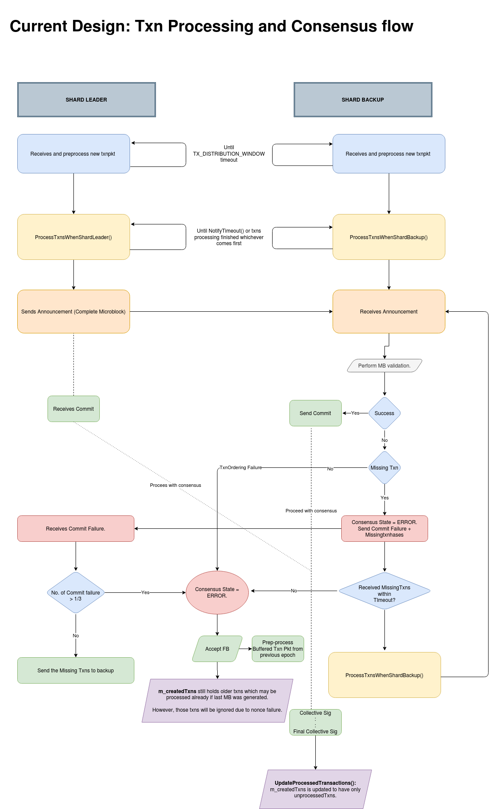
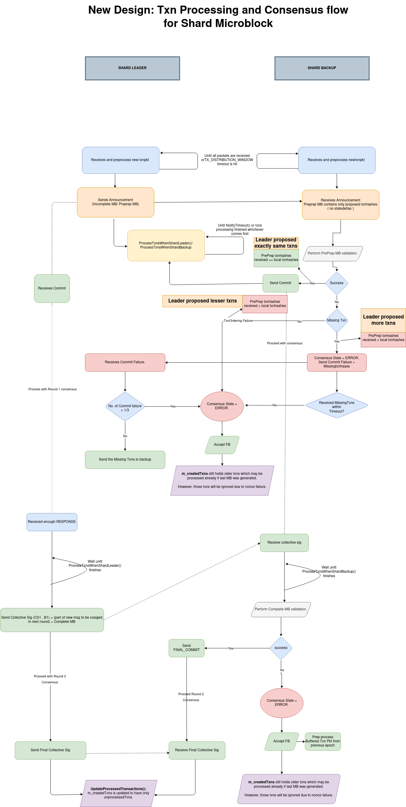

|  ZIP | Title | Status| Type | Author | Created (yyyy-mm-dd) | Updated (yyyy-mm-dd)
|--|--|--|--| -- | -- | -- |
| 14  | Revised pBFT Consensus | Implemented | Standards Track  | Sandip Bhoir <sandip@zilliqa.com>   George Pîrlea george@zilliqa.com | 2020-12-10 | 2021-05-11

## Abstract

This ZIP proposes revising Zilliqa's consensus - based on Practical Byzantine Fault Tolerance (pBFT) - to add robustness to the network in high load circumstances where nodes may have varying transaction sets.

## Motivation

Currently, transactions are processed before each node participates in consensus. If a node goes into consensus with a set of transactions different from the expectation (e.g., if the node fails to receive a transaction packet), it can be too late for that node to request the missing transactions from the consensus leader and then rerun consensus again. With the proposed pBFT revision, this issue is effectively handled, thereby allowing the network to progress more reliably.

## Specification

### Existing pBFT flow

Please refer below for more details on the current behaviour of pBFT for shard microblock consensus.

### Proposed pBFT flow

Please refer below for more details on new behaviour of pBFT for shard microblock consensus. The same revision applies for final block consensus.

> **Note:** This revised pBFT is applicable only for shard-level microblock consensus and Directory Service-level final block consensus, which basically involve transaction processing.

These are important points to consider for the pBFT revision:

**Round 1:**
- Round 1 of consensus (also known as the `pre-prepare` phase) will run consensus on microblock/final block with a set of transaction hashes. This phase is for the committee to agree on the set of transactions to process.
- Leader starts transaction execution after sending out `pre-prepare` announcement (the microblock/final block consensus announcement contains transaction hashes only).
- Backups start transaction execution after sending out commit to the leader for `pre-prepare` phase.
- However, if there is a commit failure (e.g., due to missing transactions), the backup will fetch the missing transactions from the leader and rerun the `pre-prepare` phase (round 1) of consensus.
- For any other commit failures, please refer to the new flow diagram.

**Round 2:**
- After the leader executes all transactions (or after a timeout is triggered), it sends the collective signature (for round 1) along with the microblock/final block to all backups.
- By the time the leader's message is sent out, backups are expected to have also completed processing of the transactions that were proposed in pre-prepare phase.
- Backups validate the leader's message and send final commit.
- However, if there is a commit failure, the backup will move to ERROR state and proceed according to the current design.
 
## Implementation

This ZIP is implemented in the following pull requests in the Zilliqa core repository:
- [PR 2216](https://github.com/Zilliqa/Zilliqa/pull/2216)

## Copyright Waiver

Copyright and related rights waived via [CC0](https://creativecommons.org/publicdomain/zero/1.0/).
