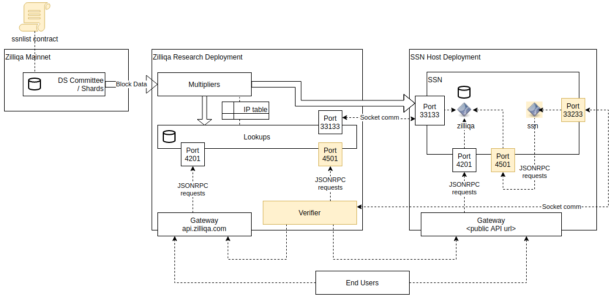
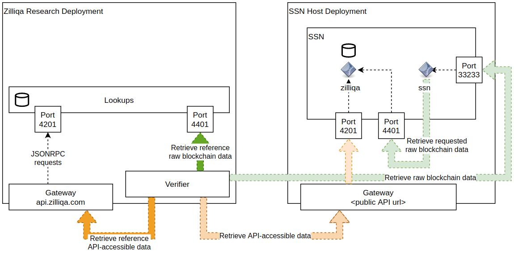

| ZIP | Title                        | Status | Type  | Author                                                                                                                       | Created (yyyy-mm-dd) | Updated (yyyy-mm-dd) |
| --- | ---------------------------- | ------ | ----- | ---------------------------------------------------------------------------------------------------------------------------- | -------------------- | -------------------- |
| 3   | Seed Node Staking Mechanism | Draft  | Standards Track | Amrit Kumar <amrit@zilliqa.com> <br> Antonio Nunez <antonio@zilliqa.com> <br> Arthur Cheong <arthurcheong1@gmail.com> <br> Clark Yang <clark@zilliqa.com> <br> Jun Hao Tan <junhao@zilliqa.com> <br> Sandip Bhoir <sandip@zilliqa.com> | 2020-01-30           | 2020-03-08           |

## Abstract

ZIP-3 defines a staking mechanism at the core protocol to promote and regulate the participation of _seed node_ hosts in the Zilliqa network.

## Background & Motivation

The Zilliqa network architecture consists of several types of nodes with different functionalities and responsibilities. One of such nodes is called the _seed nodes_. The main role of seed nodes is to serve as direct access points (for end users and clients) to the core Zilliqa network that validates transactions. Seed nodes consolidate transaction requests and forward these to the _lookup nodes_ (another type of nodes) for distribution to the shards in the network. As "archival nodes", they further maintain the entire transaction history and the global state of the blockchain which is needed to provide services such as block explorers.  

Seed nodes can therefore be considered as an ancillary set of nodes that play a supporting yet critical role in the overall Zilliqa network architecture. 

> Note:  Seed nodes however do not validate transactions themselves and as a result do not run any consensus protocol. 

Seed nodes are currently being run by several major exchanges, application providers such as [Xfers](https://www.xfers.com/sg/), the block explorer provider [ViewBlock](https://viewblock.io/zilliqa), and the Zilliqa Team itself. Most of these seed nodes are however "closed", i.e., they only serve the needs of the seed node operator and not the broader community.

The purpose of this ZIP is to propose a mechanism to "open up" some of these nodes and decentralize the overall seed node architecture. To this end, a proper incentive mechanism must be put in place. With the right monetary incentive, seed nodes can potentially be hosted by any entity say wallet providers, as well as the entire community at large. In the interest of decentralization, a means to facilitate the addition and management of seed nodes must also be implemented within the protocol. In order to maintain the overall health of the network, it is also essential to establish a minimum performance threshold for these seed nodes.

Staking provides one approach to both promoting widespread participation and ensuring an acceptable level of performance from participants. The idea of staking is to pre-qualify seed hosts by requiring them to stake a certain minimum amount of ZILs for the duration of the service provided. Within this duration, the host presents regular proofs of its ability to provide the service. In return, the hosts are rewarded a proportional amount of ZILs in a predetermined manner.

## Seed Node Staking Phase 0: Overview & Design Considerations

This ZIP presents the first phase (dubbed **Phase 0**) for implementing staking for seed nodes. In this first phase of implementation, the main idea is to implement staking via a smart contract without slashing, i.e., node operators who wish to host a seed node will have to deposit a certain minimum number of ZILs in a smart contract by transferring the tokens to the contract. 

In return, if the nodes provide the expected service, they will be granted a part of the block rewards. In the scenario where a seed node operator is unable to provide the basic minimum service, the deposited stake will not be slashed. Instead, nodes providing poor service will forfeit the reward. The staking architecture has a _Verifier_ node that periodically checks whether a seed node operator is indeed providing the service for which it is rewarded.

A seed node operator that does not have the minimum number of ZILs to stake may open up this service to other token holders who may not have the right expertise to run a seed node themselves. The way in which the custody of tokens is handled is left to the seed node operator.

> Note: The form of staking being proposed in this ZIP is not a PoS protocol. A PoS protocol or its variants such as dPoS are a type of consensus protocol that allows validators to validate transactions and propose new blocks. Staking for seed nodes as proposed in this ZIP on the other hand does not lead to a consensus protocol for validating transactions and proposing new blocks.

Due to these design considerations, **Phase 0** is not extremely intrusive to the core protocol. However, it does present some areas for improvements which will be the goal of the next phases: 


* **Delegation of Stakes:** **Phase 0** requires seed node operators and token holders to deposit the stake in a smart contract. One possible improvement would be to not require them to transfer funds but instead lock those funds at the core protocol level, i.e., funds do not move but only stay locked. This will require handling the entire staking architecture at the protocol-level, which, due to its intrusive nature, can be handled in the next phases based on the success of **Phase 0**. <br/>  <br/>
Another idea that is not intrusive to the core protocol and yet presents a safer and more useful alternative to simple token locking for delegated staking would be to implement [bonded stakes](https://blog.chorus.one/delegation-vouchers/). Bonded stakes allow a token holder to delegate her stake (by transferring the tokens to a seed node operator), to receive wZILs (a wrapped version of ZILs) in return. wZILs however come with usage restrictions in the sense that the moment a token holder redeems wZILs for actual ZILs, she loses her stake. However, she can use wZILs in other applications such as a DeFi dapp that requires collateral. <br/> <br/>
On the other hand, an extremely intrusive idea for future iterations would be to change the underlying account model. Currently, the protocol supports two types of accounts: a user account (aka an externally owned account) and a contract account. Many of the application-level features such as delegated staking involve user accounts but require some added functionalities such as the ability to lock the tokens. Implementing such a feature would be much easier if every account were a contract account. In that case, a user could lock her tokens, delegate them, burn them or put any arbitrary logical restrictions on her tokens. The Move language from Libra follows this single account-type model.

* **Detecting Cheating/Malicious Operators:** In **Phase 0**, the Verifier implements rather simple checks to monitor the health of a seed node, such as checking if the seed node holds data for randomly chosen blocks and is alive when a fetch request (for a block data) is made. One possible improvement could be to implement a [Proof of Retrievability protocol](http://www.arijuels.com/wp-content/uploads/2013/09/BJO09b.pdf) - a protocol that runs between a client and a data storage provider that guarantees that the data storage provider indeed holds a certain data that the client has outsourced to the storage provider.

* **Decentralizing Verifiers:** Another area for improvement in the next phases would be to have a decentralized layer of Verifiers, where any node can potentially become a Verifier node and monitor seed nodes and report any Proof of Poor Service (or PoPS) and get rewarded for it. Such designs have been extensively explored in the past for example in [TrueBit](https://people.cs.uchicago.edu/~teutsch/papers/truebit.pdf).

> Note: An alert reader may argue that in **Phase 0**, requiring seed nodes to stake may not be necessary from an engineering perspective specially when the design does not include slashing. Indeed, seed nodes could simply be rewarded for the service they provide. <br/> <br/> We however argue that "opening up" the seed node architecture has to be addressed from both engineering and economic angles. The network architecture has to support seed nodes hosted by different parties, without breaking security - this has to be addressed though engineering. But, there has to be a motivation to host the seed nodes - without that, no party would be interested. The platform has to therefore incentivize. This is done by rewarding the seed node operators. <br/><br/> But, how can the rewarding be fair so that it encourages seed nodes to continue providing the service for a long time? This is achieved by staking (the proportion of “skin in the game”). By depositing ZILs, a seed node operator shows its commitment towards providing the seed node service. Without the "skin in the game", a seed node operator could decide to stop the service at will and may impact the ecosystem and the end users. <br/> <br/> Staking has the added benefit of getting token holders to participate and get rewarded - they can stake a portion of their holding together with the seed node operators.  Furthermore, including staking will allow to prepare for the later phases when slashing could be implemented. Slashed ZILs could also be given to the Verifiers who monitor and fish for inactive seed nodes.

## Economic Parameters

Given that there is a monetary incentive at play, the economic parameters of the system has to be attractive for seed node operators. However, this should not happen at the expense of increased inflation or diluting the maximum token supply. The maximum supply should remain fixed at 21 billion ZILs. 

The Zilliqa protocol currently allocates 5% of block rewards (that gets disbursed to the miners every hour or so) to reward lookup nodes. We therefore propose to use this pool to reward seed nodes, i.e., block rewards will be split between miners (validating transactions) getting 95% and seed node operators (providing the supporting role) receiving 5% of the block reward. The table below presents a further breakdown. Note that block rewards get distributed at the end of each DS epoch. 

In the rest of the discussion, we assume 1 ZIL = USD 0.006 (price at the time of writing this ZIP).

| Mainnet parameter                   | Value        |
| ----------------------------- | ------------ |
| Total mining reward distributed per DS epoch  (in ZIL) | 263,699  | 
| Average duration of a DS epoch (in mins) | 95  |
| Number of DS epochs per day        | 15          |
| Number of DS epochs per year |5,533 |
| Percentage of reward proposed for seed nodes | 5% | 
| Total reward available for seed nodes per DS epoch (in ZIL) | 263,699 x 0.05 = 13,185 |
| Total reward available for seed nodes per year (in ZIL) | 5,533 x 13,185 = 72,947,368|

As shown in the table above, if 5% of block reward goes to the seed nodes, then a total of ~72 million ZILs per year (~USD 437k) can be used to provide the necessary incentives. With this total reward available, we propose the following economic parameters for staking:

| Staking parameter                           | Value                 |
| ------------------------------------------- | --------------------- |
| Maximum overall staked amount (in ZIL)      | 700,000,000           |
| Maximum stake amount (in ZIL) per seed node | 70,000,000            |
| Minimum stake amount (in ZIL) per seed node | 10,000,000            |
| Maximum number of seed nodes                | 10                    |
| Annual interest rate                        | 10.42%                |
| Rewarding cycle                             | 15 DS blocks (~1 day) |

We propose to limit the total staked amount across all seed nodes so as to ensure that the interest rate remains attractive for each seed node operator. This is fixed to 700 million ZILs (~USD 4.2 million). In other words, a maximum of 700 million ZILs will ever be locked. 

With this overall maximum, if 20 seed node operators participate in the staking program, then each seed node could stake up to 35 million ZILs (~USD 210k). However, with 10 seed nodes, the maximum that each seed node would be able to stake will be higher at 70 million ZILs (~USD 420k). For **Phase 0**, we propose to start with a maximum of 10 seed nodes - a number that we can revisit depending on the success of **Phase 0**.

Given that 72,947,368 ZILs is the maximum possible reward that can be disbursed per year, the annual percentage yield for the maximum staked amount of 700 million ZILs is (72,947,368 / 700,000,000) x 100 = 10.42%.

Each seed node operator will have to stake a minimum of 10 million ZILs (~USD 60k) to ensure that each operator has enough "skin in the game". This minimum requirement is at the seed node level and not at the individual user or token holder level. Each seed node operator is in fact free to decide a minimum that it thinks is reasonable to attract end users and become the preferred seed node operator in the market.

As for locking, any seed node is free to withdraw its deposit and reward at any point of time. This is to allow no active lockup of tokens in the contract.

## Specification

### A. Terminology and Roles

| Name                         | Description                                                         |
| ---------------------------- | ------------------------------------------------------------------- |
| Staked Seed Node (SSN)       | The seed node that joins the network through this staking mechanism |
| Verifier                     | A dedicated machine for monitoring SSNs                             |

### B. Setup

The diagram below shows the overall setup. In particular, the colored areas suggest the components that must be created for this staking mechanism.



The setup includes the following:

#### Within Zilliqa Research
1. A Verifier node monitors the performance of SSNs and dispenses rewards accordingly through smart contract transactions.
2. A series of multipliers forward mined blockchain data from the mainnet to a whitelist of IP addresses.
3. A set of lookups provide the reference data to the Verifier, including publicly accessible data (through [api.zilliqa.com](https://api.zilliqa.com/)) and raw data with access limited to the Verifier.

#### Within Hosting Entity
1. A SSN node acts as a typical seed node and receives blockchain data from the multipliers. It provides publicly accessible data through its own API address and raw data with access limited to the Verifier.

### C. Staking Proofs

There are three things that a SSN must satisfy in order to receive staking rewards:
1. It must be recognized as an active SSN in the staking smart contract.
2. It must pass the checks for raw data storage requested by the Verifier.
3. It must pass the checks for servicing API requests by the Verifier.

#### SSN Activation

SSN registration is performed during an initial handshake process between the Verifier and the SSN and concludes with the addition of the SSN into the staking smart contract.

SSN activation, which can be done anytime after, requires the SSN host to deposit into the contract an amount satisfying both the minimum and maximum stake criteria (invalid amounts are rejected from being deposited).

#### Storage and API Checks

The Verifier polls the SSN for raw blockchain data and API-retrievable data to effectively confirm that the SSN both stores the blockchain data and services API requests from end users.

Raw blockchain data is accessible from the lookups on the Verifier's end and from the SSN on the host's end.

The diagram below shows the interaction between the different components for the storage and API checks.



### D. Staking Smart Contract Specification

As part of this staking mechanism, a smart contract named `SSNList` is deployed to facilitate the rewarding scheme and maintain the list of SSNs.

#### Roles

| Name            | Description                                       |
| --------------- | ------------------------------------------------- |
| `verifier`      | The Verifier node                                 |
| `init_admin`    | The initial admin to this contract                |
| `contractadmin` | The current admin to this contract                |
| `ssn`           | A registered SSN node                             |

#### Immutable Variables

| Name          | Type      | Description                   |
| ------------- | --------- | ----------------------------- |
| `init_admin`  | `ByStr20` | Address of the initial admin  |

#### Mutable Fields

| Name        | Type                                | Description                                        |
| ----------- | ----------------------------------- | -------------------------------------------------- |
| `ssnlist`   | `Map ByStr20 Ssn = Emp ByStr20 Ssn` | Mapping between SSN address and the following information: <br> - `active_status` (`Bool`) <br> - `stake_amount` (`Uint128`) <br> - `rewards` (`Uint128`) <br> - `urlraw` (`String`) <br> - `urlapi` (`String`)|
| `minstake`  | `Uint128`                           | Minimum `stake_amount` required to activate a SSN |
| `maxstake`  | `Uint128`                           | Maximum `stake_amount` allowed to activate a SSN |
| `contractadmin` | `Option ByStr20  = None {ByStr20}` | Address of user with administrator access to this contract |

#### Transitions

##### 1. update_minstake

```ocaml
(* @dev: Set the minstake of contract. Used by verifier only. *)
(* @param min_stake: New minstake value *)
transition update_minstake (min_stake : Uint128)
```

##### 2. update_maxstake

```ocaml
(* @dev: Set the maxstake of contract. Used by verifier only. *)
(* @param max_stake: New maxstake value *)
transition update_maxstake (max_stake : Uint128)
```

##### 3. update_admin

```ocaml
(* @dev: Set the admin of contract. Used by admin only. *)
(* @param min_stake: New admin value *)
transition update_admin (admin : ByStr20)
```

##### 4. update_verifier
```ocaml
(* @dev: Set the verifier of contract. Used by admin only. *)
(* @param min_stake: New admin value *)	(* @param verif: New verifier value *)
```

##### 5. deposit_funds

```ocaml
(* @dev: Move token amount from _sender to recipient i.e. contract address. *)
transition deposit_funds ()
```

##### 6. stake_deposit

```ocaml
(* @dev: Moves an amount tokens from _sender to the recipient. Used by token_owner. i.e. ssn *)
(* @dev: Stake amount of exisitng ssn in ssnlist will be updated with new amount only if existing stake amount is 0. 
         Balance of contract account will increase. Balance of _sender will decrease.      *)
transition stake_deposit ()
```

##### 7. add_ssn

```ocaml
(* @dev: Adds new ssn to ssnlist. Used by verifier only. *)
(* @param ssnaddr: Address of the ssn to be added *)
(* @param urlraw: string representing "ip:port" of the ssn serving raw api request *)
(* @param urlapi: string representing url exposed by ssn serving public api request *)
(* @param blocknumber: Block number when the verifier invoked this transition *)
transition add_ssn (ssnaddr : ByStr20, urlraw : String, urlapi : String)
```

##### 8. assign_stake_reward

```ocaml
(* @dev: Assign stake reward to specific ssn from ssnlist. Used by verifier only. *)
(* @param ssnaddr: Address of the ssn to be awarded the reward *)
(* @param reward_percent: reward share awarded to ssn *)
transition assign_stake_reward (ssnaddr : ByStr20, reward_percent : Uint128)
```

##### 9. withdraw_stake_rewards

```ocaml
(* @dev: Withdraw stake reward. Used by ssn only. *)
transition withdraw_stake_rewards ()
```

##### 10. withdraw_stake_amount

```ocaml
(* @dev: Move token amount from contract account to _sender. Used by ssn only. *)
(* @param amount: token amount to be withdrawed *)
transition withdraw_stake_amount (amount : Uint128 )
```

##### 10. remove_ssn

```ocaml
(* @dev: Remove a specific ssn from ssnlist. Used by verifier only. *)
(* @param ssnaddr: Address of the ssn to be removed *)
transition remove_ssn (ssnaddr : ByStr20)
```

##### 12. drain_contract_balance

```ocaml
(* @dev: Set the admin of contract. Used by verifier only. *)
(* @param min_stake: New admin value *)
transition drain_contract_balance ()
```

### E. Staking Procedure

#### Step 1 - Zilliqa Research sets up the staking components

A dedicated machine running the Verifier process is launched. A key pair is assigned to the Verifier.

The `SSNList` smart contract is deployed and initialized with the address of the Verifier. The `update_minstake`, `update_maxstake`, and `update_admin` transitions are called to initialize the staking settings. The `deposit_funds` transition is also called to fund the contract for the rewards distribution.

#### Step 2 - Host registers with Zilliqa Research

The entity intending to host a SSN registers with the Zilliqa Research team. Zilliqa Research assesses the suitability of the operator to host a SSN. After the assessment, the registration process includes whitelisting the IP address so that the multipliers and lookup nodes can communicate with the SSN.

#### Step 3 - Host launches SSN

The `zilliqa` process is launched in the host machine in the manner typical of a seed node. As a typical seed node, the SSN should be able to service API requests at this point through the host's own API domain (akin to [api.zilliqa.com](https://api.zilliqa.com)).

#### Step 4 - Zilliqa Research adds SSN to smart contract

Zilliqa Research calls the `add_ssn` transition in the smart contract, which creates an entry for the SSN in the `ssnlist` table in the contract. The `ip_addr` in the entry is initialized to the IP address of the SSN. The entry's `urlraw` and `urlapi` values are also set to indicate the addresses to query the SSN node's raw data (via port 4501) and publicly accessible data (via port 4201).

#### Step 5 - Host deposits funds for staking

A SSN in the `SSNList` contract with `stake_amount` falling below `minstake` is not considered active at this point, and is ignored by the Verifier. The host must activate its SSN by depositing funds into the contract through a single call to the `stake_deposit` transition.

#### Step 6 - Verifier performs regular checks

The Verifier accesses the list of SSNs in the smart contract. For each active SSN, it performs the storage and API servicing checks at periodic intervals.

#### Step 7 - Verifier distributes rewards

For each SSN, the Verifier calls the `assign_stake_reward` transition in the smart contract at periodic intervals to trigger the rewards distribution. The reward amount is added to the `reward` for the SSN in the `ssnlist` table. See the [Rewarding Algorithm](#g-rewarding-algorithm) section for the details.

#### Step 8 - Host withdraws rewards

A host may at any time withdraw any available funds from its SSN by calling the `withdraw_stake_rewards` transition in the smart contract. This transition transfers the reward amount from the smart contract balance to the address of the SSN.

#### Step 9 - Host de-registers as a SSN

If an entity decides to conclude its participation as a SSN host, it does so by performing the following in sequence:
1. calling the `withdraw_stake_rewards` transition in the smart contract to withdraw the entire `reward` amount
2. calling the `withdraw_stake_amount` transition in the smart contract to withdraw the entire `stake_amount` amount

The second step above automatically removes the SSN from the `ssnlist`.

> Note: Although the smart contract also contains a `remove_ssn` transition, this is not intended for normal situations and can only be invoked by the Verifier when necessary.

Finally, the entity requests the Zilliqa Research team to remove the IP address of the SSN from the network's whitelist.

### F. Verification and Rewarding Frequencies

SSN verification involves the checks listed in the [Staking Proofs](#c-staking-proofs) section.

After SSN activation, verification is done a maximum of `NUM_OF_RUNS_EACH_REWARD_CYCLE` times within the span of `NUM_OF_DSBLOCK_EACH_REWARD_CYCLE` DS epochs, with the verification runs done at randomized intervals. The Verifier tracks the number of verification runs performed during the current reward cycle, and this count is applied across all SSNs.

After `NUM_OF_DSBLOCK_EACH_REWARD_CYCLE` DS epochs, the Verifier calls the smart contract to trigger the rewards distribution.

### G. Rewarding Algorithm

The Verifier is configured to dispense `EFFECTIVE_INTEREST_RATE` as the effective interest rate per rewarding cycle. This has to be set based on the annual interest rate divided by the expected number of reward cycles within a year. That is:

```
EFFECTIVE_INTEREST_RATE = annual interest rate / reward cycles per year
```

SSNs are rewarded based on the percentage of successful verification runs performed within the `NUM_OF_DSBLOCK_EACH_REWARD_CYCLE` cycle. A SSN can potentially earn less than the potential maximum reward for the cycle if it either fails one or more verification runs or if it joins in the middle of a rewarding cycle and is unable to undergo the full number of verification runs.

When the Verifier calls the `assign_stake_reward` transition to perform the rewarding, the `reward_percent` parameter is thus set as:

```
reward_percent = EFFECTIVE_INTEREST_RATE x success rate of verification runs
```

### H. Minimum System Requirements
- x64 Ubuntu operating system (e.g., `Ubuntu 16.04.05 LTS`, `Ubuntu 18.04.4 LTS`)
- Quad core processor (e.g., `Intel Xeon Skylake` family)
- 16GB RAM
- 300GB SSD
- 200Mbps (up/down) bandwidth
- 24/7 uptime 
- Public IP address
- Domain name
- Valid SSL certificate

## Backward Compatibility

The staking mechanism is intended to work alongside the existing core protocol and should be fully backward compatible with all its components, i.e., no change in behavior should be observable on the mainnet operation with this mechanism in place.

## Copyright Waiver

Copyright and related rights waived via [CC0](https://creativecommons.org/publicdomain/zero/1.0/).
