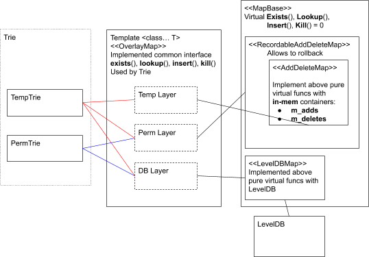
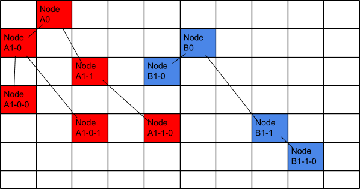
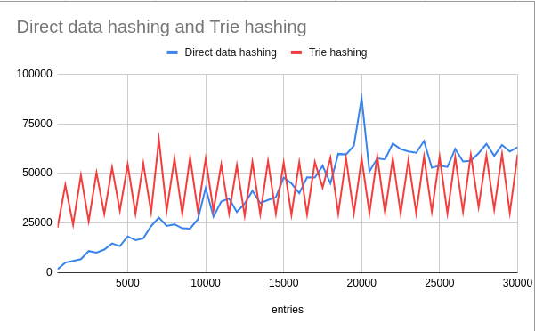

|  ZIP | Title | Status| Type | Author | Created (yyyy-mm-dd) | Updated (yyyy-mm-dd)
|--|--|--|--| -- | -- | -- |
| 8  | Adopting MPT for Contract State Hashing | Draft | Standards Track  | Liu Haichuan <haichuan@zilliqa.com>| 2020-06-05 | 2020-06-05

## Abstract

This ZIP details how **Merkle Partricia Trie** (MPT) is adopted to improve the performance of contract state hashing.

## Motivation

In the past, generating the representation of contract state is achieved by hashing the byte data of the whole state storage, which is of linear *O(N)* computational complexity. If there are millions of entries in a contract's storage, which could be common nowadays, it would take an extremely long time for this process to end. Since MPT is a tree-formed key-value storage data structure, its lookup, insert, and delete operations are of *O(logN)* computational complexity. Additionally, it can also provide the representation of the data stored by its top root hash. It will thus be of great benefit to integrate MPT into the Zilliqa core.

## Specification

### Merkle Patricia Trie
Please refer to this [article](https://medium.com/codechain/modified-merkle-patricia-trie-how-ethereum-saves-a-state-e6d7555078dd) for more details on Merkle Patricia Trie.

These are the main points to consider:
1. MPT is a collision-resistant key-value storage data structure.
2. It has O(logN) complexity for inserting, searching, and deleting operations.
3. The address of each tree node is the hash of its value part, which can be used for locating the node in the tree, and which also serves as the key in a database.

### Trie
Here we explain how MPT is architected within our system. It includes these parts:
- [*TrieDB.h*](https://github.com/Zilliqa/Zilliqa/blob/master/src/depends/libTrie/TrieDB.h): The core logic part for realizing Merkle Patricia Trie
- [*MemoryDB.h*](https://github.com/Zilliqa/Zilliqa/blob/master/src/depends/libDatabase/MemoryDB.h): Provides in-memory container for storing the tree nodes
- [*OverlayDB.h*](https://github.com/Zilliqa/Zilliqa/blob/master/src/depends/libDatabase/OverlayDB.h): An inherited class of MemoryDB that interfaces with database for committing the in-memory data to permanent storage, and accessing it.


However, the system above is not sufficient since for contract storage the following features have to be met:
- Delta formation: Can comply with different tiers of `AccountStore` to generate contract-related state delta.
- Atomic commitment: Can cache the temporary updates during transaction processing, and commit in one shot after success (or discard otherwise).
- Reversibility: Even though states are committed into permanent storage, it is still possible to roll back changes if the network triggered a view change.

### MPT for Contract State Storage
The following diagram shows how MPT is structured and utilized for contract state storage.


* **TempTrie**: Corresponds to `AccountStoreTemp` in the current implementation. It generates storage root hash of contract account after applying the contract transaction.
* **PermTrie**: Corresponds to `AccountStore` in the current implementation. It generates storage root hash for finalized contract states (after committing the delta during FinalBlock consensus).
* **OverlayMap**: A variadic template class which provides the four essential operations (exists, lookup, insert, kill) required by Trie, with arbitrary numbers of embedded container layers to traverse recursively. The following are the basic logics of handling those operations:
  - **exists**: If key is found in head layer, return `true`. Otherwise, check the next layer. If reached the last layer and still not found, return `false`.
  - **lookup**: If key is found in head layer, return its value. Otherwise, check the next layer. If reached the last layer and still not found, return empty string.
  - **insert**: Insert key-value pair into the head layer.
  - **kill**: Remove key-value pair from current layer.
* **AddDeleteMap**:
  - `m_adds`: Newly added or updated key-value pair of contract state.
  - `m_deletes`: Keys to be deleted from database later. Before the commitment happens, it will be used as a filter to exclude values found from `m_adds` in the lower layers.

### Demonstration on How Contracts Share One Database Table for Storage



- The diagram above shows how two state tries can co-exist in one single database table. Each node in a trie has a hash string as its key.
- All the red blocks represent the nodes of the state trie for contract A. If we want to fetch the value stored in Node A1-0, firstly we will initialize the trie with the root node Node A0 and set rootHash to its key. Then, we extract the value in Node A1-0 using the search algorithm defined in MPT. The process is similar for all the other operations (insert, remove, etc.)

## Implementation

This ZIP is implemented in the following pull requests in the Zilliqa core repository:
- [PR 2088](https://github.com/Zilliqa/Zilliqa/pull/2088)

### Benchmarks



The diagram above is the benchmark result of comparing direct data hashing against trie storage. Each entry represents a new field in a map data type for contract Simple-Map (see [Appendix A](#a-simple-map-contract) below). The time is measured in microseconds.

To simulate a realistic scenario, for every 100 new fields added by processing transactions, we dump the fields from the temporary state map into the permanent state map. For every 1,000 new fields added, we dump all the in-memory state into disk, and clear the memory thereafter.

For direct data hashing, we can observe a linear trend for the time spent over the number of entries in the map. For trie hashing, the trend almost complies to the expectation of O(logN).

However, when the number of entries is small, direct hashing takes much less time. So, if there is no map data type in the contract, we can still choose to adopt the current solution instead of MPT.

## Backward Compatibility

The way of generating the storage hash will be different, and a data migration is needed to apply the change to all the affected existing contracts. Thus, this feature is not backward compatible and cannot be applied to the blockchain before the point of implementation.

## Appendix

### A. Simple-Map Contract
```
scilla_version 0
library SimpleMap
let one = Int32 1
let inc =
  fun (a : Int32) =>
    builtin add a one
contract SimpleMap()
field access_count : Map ByStr20 Int32 = Emp ByStr20 Int32
transition Increment ()
  cur <- access_count[_sender];
  match cur with
  | Some i =>
    j = inc i;
    access_count[_sender] := j
  | None =>
    access_count[_sender] := one
  end
end
procedure IncrementN (n : Int32)
  cur <- access_count[_sender];
  match cur with
  | Some i =>
    j = builtin add i n;
    access_count[_sender] := j
  | None =>
    access_count[_sender] := one
  end
end
transition IncrementNOpt (nopt: Option Int32)
  match nopt with
  | Some n =>
    IncrementN n
  | None =>
  end
end
```

## Copyright Waiver

Copyright and related rights waived via [CC0](https://creativecommons.org/publicdomain/zero/1.0/).